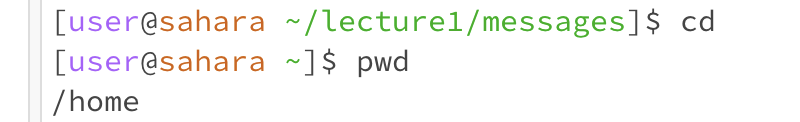
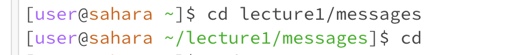
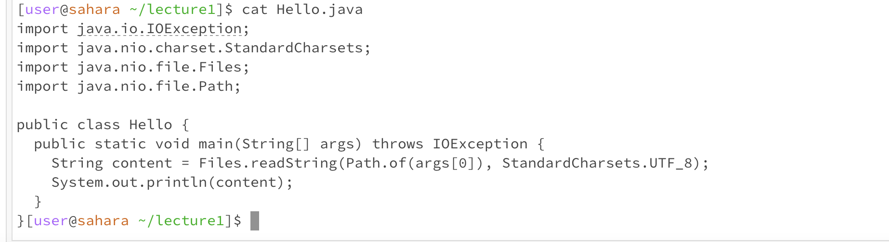

## Lab Report 1 
__cd:__ This command allows you to change the directory you are currently located in 
1. If you type cd with no args, it will return you to the home directory. I started by changing my directory to lecture1 and then messages and when I typed in cd next, it immediately returned me to the home directory. This example is not an error and we get the correct expected output. The working directory before the cd command is `/home/lecture1/messages` and after the command executed is `/home`.  

2. If you pass in a proper working path to cd, you will be able to change into that directory. Because I knew that lecture1 was the only directory that could be accessed from home and messages could only be accessed from lecture1, I passed in the proper order seperated by forward slashes. The command works as intended by placing me in the messages directory. This example is not an error and we get the correct expected output. The working directory changed from `/home` to `home/lecture1/messages`.
	

3. When I pass a file as a parameter, I get an error saying that da.txt is not a directory. Because the parameter I am passing is not a directory, the cd command will not work and I will get an error message reminding me to pass in a directory as the output. This example is an error with the error message seen below. The working directory I ran the command in is `home/lecture1/messages`.

__ls:__ This command prints a list of files / folders in the directory you are located in. 
1. We get the following output when we pass no arguments because we are in the lecture1 directory and within lecture1, the files / folders present are `Hello.class`, `Hello.java`, `messages`, and `README`. We are essentially given a list of files and directories that are in the directory we are currently working out of. This example is not an error and we get the correct expected output. The working directory is home/lecture1.
	

2. We get the following output when we provide a path to directory as an argument because within the messages sub-directory, the files that are present are `da.txt`, `en-us.txt`, `es-mx.txt`, `zh-cn.txt`. Because we are providing the ls command prompt a specific directory, we get all the contents within that directory. This example is not an error and we get the correct expected output. The working directory I ran the command in is `home/lecture1`.
	

3. We get the following output when we provide a path to the file as an argument because the command prompt prints back the file path we provided. This example is not an error and we get the correct expected output. The working directory I ran the command in is `home/lecture1`.
	

__cat:__ This command takes a list 
1. We get the following output when we pass no arguments because the terminal is waiting for a file to read and output the file contents. If we do not pass in any files to read, we will not get an output and we need to ^C to exit the command. This example is not an error as there is no error message. The working directory I ran the command in is `home/lecture1`.
	

2. Because we are passing a directory and not a file to the cat command, we are receiving an error message that is telling us messages is a directory. The cat command only works by concatenating files, and not directories. This example is an error and the message is below. The working directory I ran the command in is `home/lecture1`.
	

3. In this case, our cat command works as intended. Because we pass in a file, we get the files' contents returned to us as an output. This example is not an error and we get the correct expected output. The working directory I ran the command in is `home/lecture1`.
	
