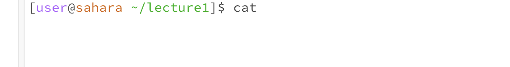

Lab Report 1 
__cd:__ This command allows you to change the directory you are currently located in 

__ls:__ This command prints a list of files / folders in the directory you are located in. 
1. We get the following output when we pass no arguments because we are in the lecture1 directory and within lecture1, the files / folders present are Hello.class, Hello.java, messages, and README
	

2. We get the following output when we provide a path to directory as an argument because within the messages sub-directory, the files that are present are da.txt, en-us.txt, es-mx.txt, zh-cn.txt  
	

3. We get the following output when we provide a path to the file as an argument because the command prompt prints the argument we provided. 
	

__cat:__ This command takes a list 
1. We get the following output when we pass no arguments because the terminal is waiting for a file to read and output the file contents. If we do not pass in any files to read, we will not get an output and we need to ^C to exit the command.  
	

2. Because we are passing a directory and not a file to the cat command, we are receiving an error message that is telling us messages is a directory. The cat command only works by concatenating files, and not directories. 
	

3. In this case, our cat command works as intended. Because we pass in a file, we get the files' contents returned to us as an output. 
	
