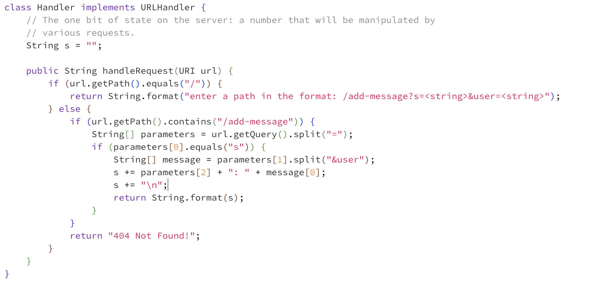
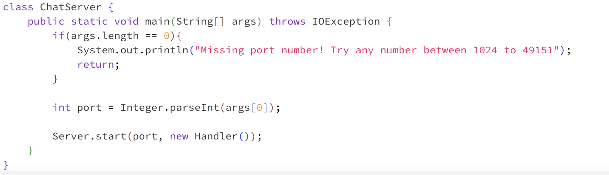
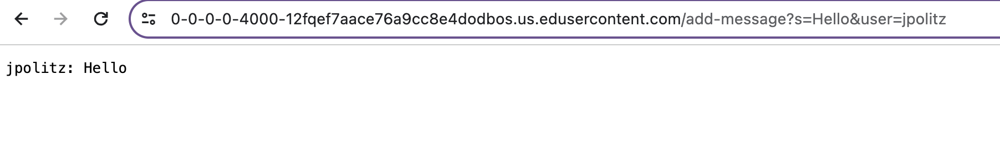
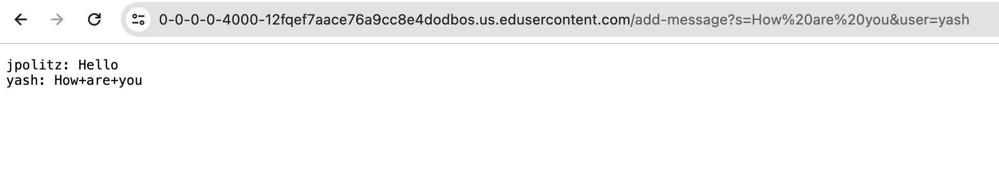
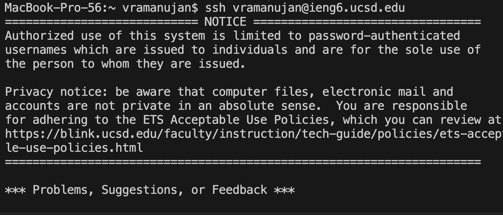

## Lab Report 2

### Part 1 
In the `ChatServer.java` class that I created, the  main method is called when I compile and run the file and pass in a port number as a command line argument. This method checks that the argument I passed  a valid integer through the terminal and starts a server with the port number given and creates a new handler object. Within the file there is another class, called 'Handler' which also has a  method with the header `public String handleRequest(URI url)`. Within the `handleRequest()` method, I intilalize an empty string and I have an conditional statement that checks whether the path is empty or whether it contains `add-message`. If the path is empty, I am assuming the user does not know how to interact with the web page and I am providing the following instructions in a message: "enter a path in the format: /add-message?s=<string>&user=<string>". If the user enters a path that contains `add-message`, I then use `url.getQuery()` to get the message and user that the user entered into the url and `String.split()` to split the user and the message. Finally, I return it as a string formatted as "<user> : <message>". 

In the first example, I first compile and run the code to start the server and I enter in 4000 as an argument to the main method for a port number. I then open the web page and add `/add-message?s=Hello&user=jpolitz` to the end of the URL. In this example, the url passed to the `handleRequest()` method is `https://0-0-0-0-4000-bv5d79p7juckpe5bg51n23r7fs.us.edusercontent.com/add-message?s=Hello&user=jpolitz`. Because my path contains `add-request`, the code in the conditional executes. The line `String[] parameters = url.getQuery().split("=");` creates a String array named parameters that splits the string after the query which is the "?" sign. The string is split based on the "=" character. In this case, the array looks like [s, Hello&user, jpolitz]. The next line makes sure the intial element of parameters is "s" (`if (parameters[0].equals("s")') as an additional check that the user followed the given formatting. The next line of code, which is `String[] message = parameters[1].split("&user");` takes the String in the second element of the parameters array and splits it by the String "&user" into an array named message. The contents of message in this case are [Hello]. The next line is `s += parameters[2] + ": " + message[0];`. This line concatenates the elements at parameters[2] which is the username, jpolitz, a colon, and message[0] which is Hello and returns the string after adding a newline, which is "jpolitz: Hello". The field value s is changed from initilization to an empty string to "jpolitz: Hello" because we are keeping track of the user and their message entered in the path through this string. In the web browser we see, "jpolitz: Hello".

In the second example, I change the path to `/add-message?s=How are you&user=yash` and the the url passed to the `handleRequest()` method is `https://0-0-0-0-4000-bv5d79p7juckpe5bg51n23r7fs.us.edusercontent.com/add-message?s=How are you&user=yash`. The line `String[] parameters = url.getQuery().split("=");` creates a String array named parameters with the elements [s, How are you&user, yash]. After that, `String[] message = parameters[1].split("&user");` takes the String in the second element of the parameters array and splits it by the String "&user" into an array named message. The contents of message in this case are [How are you]. The next line is `s += parameters[2] + ": " + message[0];`. This line concatenates the elements at parameters[2] which is the username, jpolitz, a colon, and message[0] which is Hello and returns the string after adding a newline, which is "yash: How are you". This string is concatenated with the previous value which is "jpolitz: Hello". The field value s is changed from to "jpolitz: Hello" to "jpolitz: Hello \n yash: How are you" because we are tracking all the users and their messages entered so far. In the web page, we see: 
"jpolitz: Hello"
"yash: How+are+you"
As discussed in the lab, the spaces are replaced with a specical character: "+". 

### Part 2
The absolute path to the private key is `/Users/vramanujan/.ssh/id_rsa`. 

'ssh', which stands for secure shell network, and we are using it in this case, to securely log in to a remote server. Because we used ssh-keygen during the lab to generate a public ssh key that we then copied onto the remote ieng6 machine with the scp command, we are able to use the ssh protocol to login to the ieng6 machine without a password. Attached below is a screen shot of when I enter the command `ssh vramanujan@ieng6.ucsd.edu` into my terminal, I am no longer prompted for a password. Instead, I see a Notice that tells me about the conditions of using the ieng6 machine, as shown in the screenshot, which means I have successfully logged into the machine without a password.     

### Part 3
During lab, I learned how to use the curl command to access web pages we created by passing in a url as an argument to the command prompt, which I didn't know before. We are able to see the contents of the web page printed out as an output to the terminal. We used the curl command in lab to access the server we created. Looking up documentation for the curl command, I learned that curl stands for Client URL and this command allows data to be transferred between a device and a server. 
