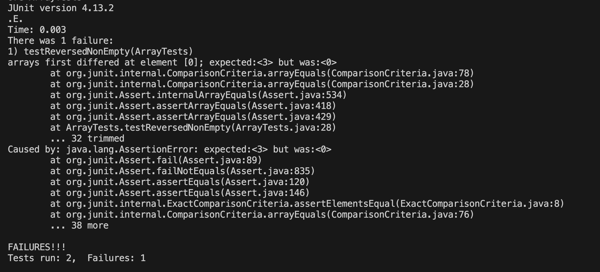

## Lab Report 3

### Part 1 
The bug I chose from week 4's lab is in the `ArrayExamples.java` class and is the `static int[] reversed(int[] arr)` method which is supposed to return a new array with all the elements in the original array reversed. To test this method, one JUnit test I wrote that failed is: 
```
 @Test
  public void testReversedNonEmpty() {
    int[] input1 = {1, 2, 3 };
    assertArrayEquals(new int[]{3, 2, 1}, ArrayExamples.reversed(input1));
  }
```
Another test I wrote that does not induce a failure is: 
```
  @Test
  public void testReversedEmpty() {
    int[] input1 = {};
    assertArrayEquals(new int[]{}, ArrayExamples.reversed(input1));
  }
```

After writing and running the JUnit tests, I got the following ouput, indicating that one test failed and the other passed:



Before making any changes, the reversed method is the following: 
```
  static int[] reversed(int[] arr) {
    int[] newArray = new int[arr.length];
    for(int i = 0; i < arr.length; i += 1) {
      arr[i] = newArray[arr.length - i - 1];
    }
    return arr;
  }
```
After looking at the test ouput, we see that the expected first value of the returned array is supposed to be 3, however it is 0. Looking more closely at the code insde the for loop, we realize that elements are being assigned to the old array from the new array instead of the other way around. We know that new empty arrays are intialized with the value 0, which could explain why the actual output in the test is returning 0. So to fix this method, I changed the assignment line inside the for loop to `newArray[i] = arr[arr.length - i - 1]` and changed the return value of the method to the new array. 

The new code is: 
```
  static int[] reversed(int[] arr) {
    int[] newArray = new int[arr.length];
    for(int i = 0; i < arr.length; i += 1) {
      newArray[i] = arr[arr.length - i - 1];
    }
    return newArray;
  }
```
