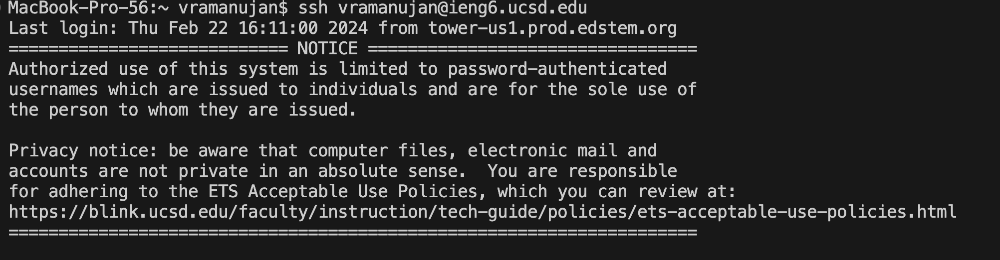
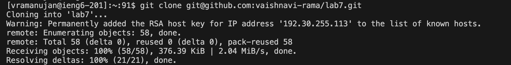
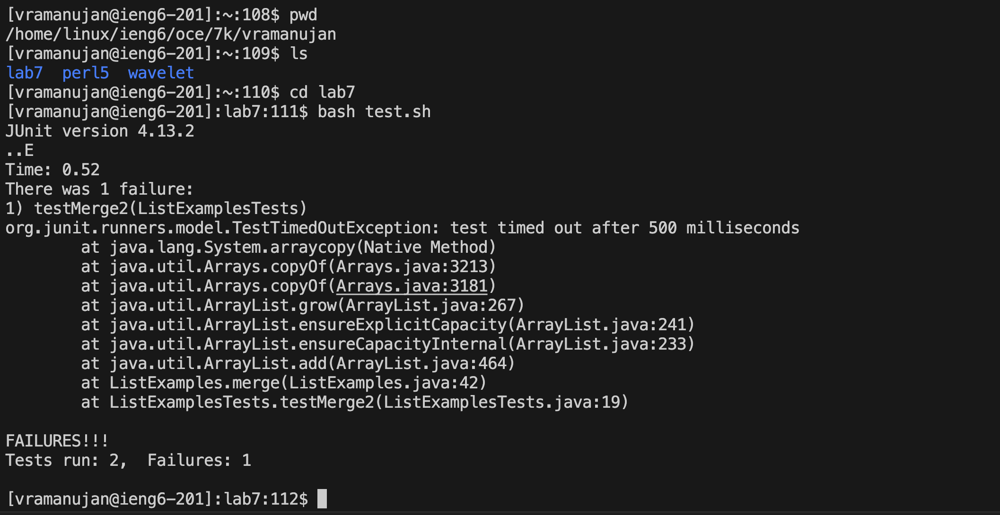
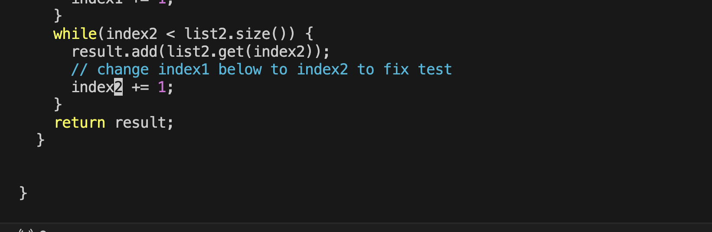
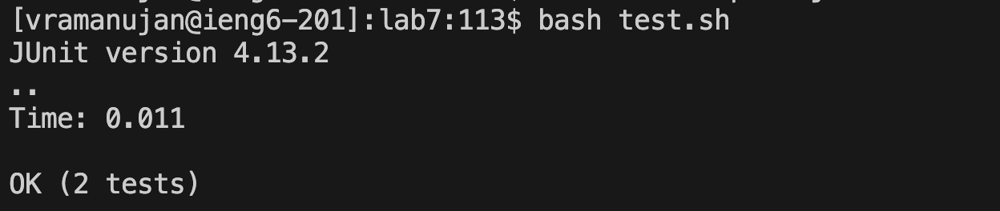
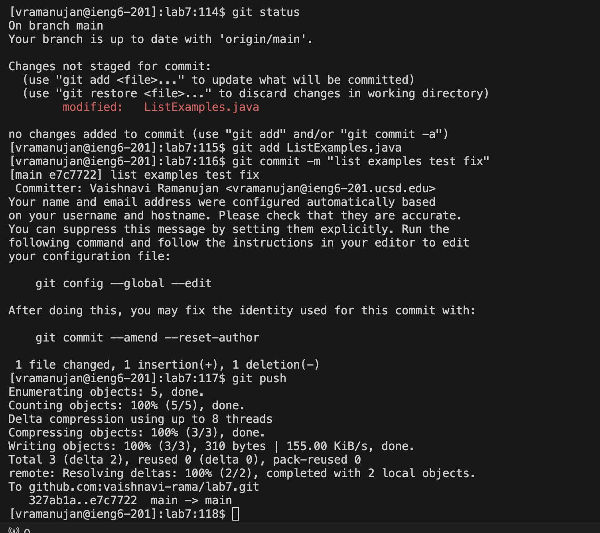

4. To log into ieng6, I opened a terminal window in my local computer and typed in `ssh vramanujan@ieng.uscd.edu <enter>`. Since I had configured ssh on this computer in a previous lab, I was able to log in without a password. 

5. Then to clone my fork of the repo from GitHub using `SSH`, I copied the url from my GitHub forked and typed the command `git clone git@github.com:vaishnavi-rama/lab7.git <enter>` into my terminal.

6. Next, to run the tests, I first had to navigate into the directory the tests were located in. I started by typing the command `pwd <enter>` into the terminal to see my working directory and then `ls <enter>` to see the list of directories I had access to. Because running the tests would only work in the lab7 directory, I typed `cd l<tab> <enter>` to change my directory to be the lab 7 directory and I used `<tab>` to fill in the rest as the only directory that started with an "l" was the "lab7". Then I typed the command `bash test.sh <enter>` as the `test.sh` script contained the commands to run and compile the tests. As the output indicated, 1 of the tests failed so we see "There was 1 failure."

7. To edit the code file to fix the failing test, I first types `vim L<tab>` into the terminal which filled in `vim ListExamples` and then I added `.j<tab>` so the command became `vim ListExamples.java` which opened up the `ListExamples.java` file in the Terminal so that I could edit the code. To navigate down to the line that needed to be fixed, I types "10j" four times so `10j 10j 10j 10j`. The letter 'j' in Vim allows you to move down one line, so by typing `10j` I could move down 10 lines at once.  Then I typed `j j j` to move 3 lines down to the line `index1 += 1` Because I was at the beginning of this line, I used the letter `l` to move right and similar to the command to move down multiple lines I typed `5l 5l` to move to the right 10 characters and then I typed `l` again to move right one character. I typed `x` to delete a character and then `i` to enter insert mode where I added a "2" so that the line became `index2 += 2`. To summarize the series of commands I entered were `10j 10j 10j 10j j j j 5l 5l l x i 2`. I then pressed `<escape>` to return to normal mode and `:wq` to save and exit.

8. To rerun the tests to make sure they passed this time, I used the up arrow to access my bash history instead of typing the command, so in the Terminal, I entered `<up><enter>` and now we are able to see "OK (2 Tests)" indicating that our tests successfully ran instead of the failure message that was displayed earlier. 

9. To commit and push the resulting change, I first entered `git status` into the Terminal to see what files changed and as expected only the `ListExamples.java` file changed. I then entered `git add <tab><enter>`, `git commit -m "list examples test fix" <enter>` to commit the changes with a commit message stating "list examples test fix". Finally, I typed `git push <enter>` to push these changes so that they are visible in my Github repo.

